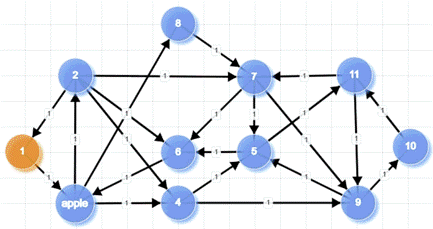

# Graph Teaching Tool

Graph Teaching Tool is an interactive web application for building graphs and visualising algorithm execution step by step. It combines a canvas-based frontend with a Flask API backend that returns trace data for animated playback.



## Features

- Interactive graph editor for creating and editing nodes and edges
- Directed and undirected graph support
- Weighted edges
- Graph validation endpoint before execution
- Step-by-step playback controls (play, pause, step, rewind, stop)
- Traversal trace visualisation with visited nodes and traversed edges
- JSON import/export support

## Supported Algorithms

- Breadth-First Search (BFS)
- Depth-First Search (DFS)

Additional algorithms can be added through the backend algorithm module pattern.

## Tech Stack

- Backend: Flask, Flask-CORS, NetworkX
- Frontend: Vanilla JavaScript (ES modules), HTML5 Canvas, CSS
- Testing: Pytest

## Project Structure

```text
graph-teaching-tool/
    backend/
        algorithms/
        app.py
        routes.py
        config.py
        requirements.txt
        tests.py
        test_routes.py
    frontend/
        index.html
        css/
        js/
```

## Getting Started

### Prerequisites

- Python 3.10+

### Installation

```powershell
python -m venv venv
venv\Scripts\activate
pip install -r graph-teaching-tool/backend/requirements.txt
```

### Run the Application

```powershell
cd graph-teaching-tool/backend
python app.py
```

Open: http://localhost:5000

## Testing

```powershell
cd graph-teaching-tool/backend
python -m pytest tests.py test_routes.py
```

## Roadmap

- Expand test coverage for edge cases and integration paths
- Add continuous integration workflow
- Extend algorithm library

## License

MIT (recommended). Add a LICENSE file if not present.
